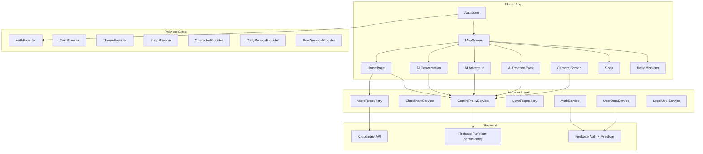

# English Learning App - Full Technical Specification

## 1. Project Overview


| Attribute            | Value                                                             |
| -------------------- | ----------------------------------------------------------------- |
| **Name**             | english_learning_app                                              |
| **Type**             | Flutter cross-platform (mobile, web, desktop)                     |
| **Target**           | Hebrew-speaking children (5-10 years) learning English vocabulary |
| **Primary Language** | Hebrew (he-IL) with English vocabulary words                      |
| **Version**          | 1.0.0+1                                                           |
| **SDK**              | Dart >=3.2.4 <4.0.0                                               |


---

## 2. Architecture Overview




---

## 3. User Flows

### 3.1 Authentication Flow

1. **App Launch** → [AuthGate](lib/screens/auth_gate.dart)
2. **No user** → [UserSelectionScreen](lib/screens/user_selection_screen.dart): Create new local user OR Sign in with Google
3. **Create user** → [CreateUserScreen](lib/screens/create_user_screen.dart): Name, age, optional Google link
4. **Sign in** → [SignInScreen](lib/screens/sign_in_screen.dart): Google Sign-In
5. **First time** → [OnboardingScreen](lib/screens/onboarding_screen.dart)
6. **Authenticated** → [MapScreen](lib/screens/map_screen.dart)

**User Types:**

- **Local user**: Stored in SharedPreferences via [LocalUserService](lib/services/local_user_service.dart); progress in [LocalUserDataService](lib/services/local_user_data_service.dart)
- **Firebase user**: Auth via [AuthProvider](lib/providers/auth_provider.dart); game data in Firestore `users/{uid}/gameData/player` via [UserDataService](lib/services/user_data_service.dart)

### 3.2 Main Navigation (Map Screen)

[MapScreen](lib/screens/map_screen.dart) is the hub with:

- **3D WebView map** (`assets/map_3d/index.html`) - Three.js islands, level nodes, Flutter-JS bridge via `MapChannel`
- **Bottom nav**: Map, Shop, Daily Missions, Settings
- **User avatar** (top-right): Switch user via [UserSwitchSheet](lib/widgets/user/user_switch_sheet.dart)
- **Level nodes**: Snake layout, star unlock requirements from [levels.json](assets/data/levels.json)

### 3.3 Level Learning Flow

1. Tap level node → [MyHomePage](lib/screens/home_page.dart) (word learning)
2. **Word display**: Image (Cloudinary/local), TTS (Google TTS or Flutter TTS), speech recognition ([KidSpeechService](lib/services/kid_speech_service.dart))
3. **Practice modes**: Speak, Camera (AI validation), Lightning Round, Image Quiz
4. **Completion** → [LevelCompletionScreen](lib/screens/level_completion_screen.dart) → coins, stars, confetti

---

## 4. Core Features (Detailed)

### 4.1 Word Learning (Home Page)


| Component                                                  | Purpose                                             |
| ---------------------------------------------------------- | --------------------------------------------------- |
| [WordRepository](lib/services/word_repository.dart)        | Load words from Cloudinary or local cache (12h TTL) |
| [WebImageService](lib/services/web_image_service.dart)     | Fetch/validate word images                          |
| [KidSpeechService](lib/services/kid_speech_service.dart)   | Child-optimized speech recognition                  |
| [SparkVoiceService](lib/services/spark_voice_service.dart) | TTS with SSML, emotion, caching                     |
| [AiImageValidator](lib/services/ai_image_validator.dart)   | Camera capture validation via Gemini                |


**Word data model** ([WordData](lib/models/word_data.dart)): `word`, `searchHint`, `publicId`, `imageUrl`, `isCompleted`, `stickerUnlocked`

### 4.2 AI Features (Gemini via Proxy)

All AI calls go through [GeminiProxyService](lib/services/gemini_proxy_service.dart) → Firebase Function `geminiProxy` ([functions/src/index.ts](functions/src/index.ts)).


| Mode       | Use Case                       | Payload                             |
| ---------- | ------------------------------ | ----------------------------------- |
| `identify` | Camera: name object in image   | `prompt`, `imageBase64`, `mimeType` |
| `validate` | Camera: does image match word? | `word`, `imageBase64`, `mimeType`   |
| `text`     | General text generation        | `prompt`, `system_instruction`      |
| `story`    | Adventure stories              | `prompt`, `system_instruction`      |


**AI-powered screens:**

- [AiConversationScreen](lib/screens/ai_conversation_screen.dart): Spark Chat Buddy via [ConversationCoachService](lib/services/conversation_coach_service.dart)
- [AiAdventureScreen](lib/screens/ai_adventure_screen.dart): Spark's Adventure Lab via [AdventureStoryService](lib/services/adventure_story_service.dart)
- [AiPracticePackScreen](lib/screens/ai_practice_pack_screen.dart): AI Practice Packs via [PracticePackService](lib/services/practice_pack_service.dart)

**Child safety**: All AI services include strict system instructions (no violence, scary content, inappropriate topics).

### 4.3 Gamification


| Feature            | Implementation                                                                                                                                                             |
| ------------------ | -------------------------------------------------------------------------------------------------------------------------------------------------------------------------- |
| **Coins**          | [CoinProvider](lib/providers/coin_provider.dart) - SharedPreferences (local) or Firestore (Firebase)                                                                       |
| **Shop**           | [ShopProvider](lib/providers/shop_provider.dart), [ShopScreen](lib/screens/shop_screen.dart) - 3 products (Magic Hat, etc.)                                                |
| **Achievements**   | [AchievementService](lib/services/achievement_service.dart) - first_correct, streak_5, etc.                                                                                |
| **Daily rewards**  | [DailyRewardService](lib/services/daily_reward_service.dart) - streak, claim flow                                                                                          |
| **Daily missions** | [DailyMissionProvider](lib/providers/daily_mission_provider.dart), [DailyMissionsScreen](lib/screens/daily_missions_screen.dart) - speakPractice, lightningRound, quizPlay |


### 4.4 Level System

- **Source**: [assets/data/levels.json](assets/data/levels.json) - levels with `id`, `name`, `description`, `unlockStars`, `reward`, `position`, `words[]`
- **Repository**: [LevelRepository](lib/services/level_repository.dart)
- **Progress**: [LevelProgressService](lib/services/level_progress_service.dart) - stars per level, per user
- **3D Map**: WebView loads `assets/map_3d/index.html`, JS sends `enter_level` / `level_locked` via `MapChannel`

---

## 5. Data Models


| Model        | File                                                       | Key Fields                                                              |
| ------------ | ---------------------------------------------------------- | ----------------------------------------------------------------------- |
| WordData     | [models/word_data.dart](lib/models/word_data.dart)         | word, searchHint, publicId, imageUrl, isCompleted                       |
| LevelData    | [models/level_data.dart](lib/models/level_data.dart)       | id, name, words, unlockStars, reward                                    |
| LocalUser    | [models/local_user.dart](lib/models/local_user.dart)       | id, name, age, googleUid, isActive                                      |
| PlayerData   | [models/player_data.dart](lib/models/player_data.dart)     | coins, purchasedItems, achievements, levelProgress                      |
| DailyMission | [models/daily_mission.dart](lib/models/daily_mission.dart) | id, title, target, reward, type (speakPractice/lightningRound/quizPlay) |
| ShopItem     | [models/shop_item.dart](lib/models/shop_item.dart)         | id, name, price, category                                               |


---

## 6. Configuration ([app_config.dart](lib/app_config.dart))

Secrets loaded in order: `--dart-define` → `.env` (flutter_dotenv) → platform env.


| Key                                      | Purpose                                 |
| ---------------------------------------- | --------------------------------------- |
| GEMINI_PROXY_URL                         | Gemini proxy endpoint (required for AI) |
| CLOUDINARY_CLOUD_NAME/API_KEY/API_SECRET | Remote word sync                        |
| GOOGLE_TTS_API_KEY                       | Server-quality Hebrew TTS (optional)    |
| PIXABAY_API_KEY                          | Bulk word upload scripts                |
| FIREBASE_USER_ID_FOR_UPLOAD              | Script target user                      |
| AI_IMAGE_VALIDATION_URL                  | Optional custom image validation        |


**Fallback**: If `GEMINI_PROXY_URL` empty, uses `https://us-central1-{projectId}.cloudfunctions.net/geminiProxy`.

---

## 7. Firebase Backend

### 7.1 Firestore Structure

```
users/{uid}
  - email, displayName, photoURL, role, lastSignInAt
  gameData/player
  - coins, purchasedItems, achievements, levelProgress, dailyStreak, character
```

### 7.2 Firebase Function: geminiProxy

- **Path**: [functions/src/index.ts](functions/src/index.ts)
- **Region**: us-central1
- **Secrets**: GEMINI_API_KEY
- **Model**: gemini-3-pro-preview (with fallbacks)
- **Operations**: identify, validate, text, story

---

## 8. Assets


| Path                    | Content                                    |
| ----------------------- | ------------------------------------------ |
| assets/images/          | General images                             |
| assets/images/map/      | Map assets                                 |
| assets/images/words/    | Fallback word images                       |
| assets/audio/           | Sound effects, music                       |
| assets/data/levels.json | Level definitions                          |
| assets/models/          | 3D models (model_viewer_plus)              |
| assets/map_3d/          | 3D map (index.html, js/main.js) - Three.js |


---

## 9. Scripts


| Script                          | Purpose                                      |
| ------------------------------- | -------------------------------------------- |
| scripts/upload_words.dart       | Bulk upload words (Pixabay, Firebase)        |
| scripts/generate_word_images.py | Regenerate word artwork from OpenMoji        |
| scripts/flutterw                | Wrapper: sources .env, injects --dart-define |
| scripts/debug_images.js         | Image debugging                              |


---

## 10. CI/CD


| Workflow                                                       | Trigger      | Action                                    |
| -------------------------------------------------------------- | ------------ | ----------------------------------------- |
| [deploy-web-pages.yml](.github/workflows/deploy-web-pages.yml) | push to main | Build Flutter web, deploy to GitHub Pages |
| [appetize-upload.yml](.github/workflows/appetize-upload.yml)   | Optional     | Upload debug APK to Appetize              |
| [test.yml](.github/workflows/test.yml)                         | -            | Test workflow                             |


**GitHub Pages**: Requires `github-pages` environment. Secrets (GEMINI_PROXY_URL, CLOUDINARY_*, etc.) forwarded to build.

---

## 11. Testing

**Location**: `test/` directory


| Category    | Files                                                                                                                                            | Coverage                |
| ----------- | ------------------------------------------------------------------------------------------------------------------------------------------------ | ----------------------- |
| Models      | word_data_test, product_test                                                                                                                     | JSON, fields            |
| Services    | adventure_story, conversation_coach, practice_pack, word_repository, cloudinary, ai_image_validator, daily_reward, achievement, level_repository | Mocked generators, HTTP |
| Providers   | coin_provider, shop_provider, theme_provider                                                                                                     | State, persistence      |
| Widgets     | score_display_test, image_quiz_game_test                                                                                                         | Asset validation        |
| Integration | widget_test                                                                                                                                      | App init                |


---

## 12. Key Dependencies


| Package                                       | Use                 |
| --------------------------------------------- | ------------------- |
| provider                                      | State management    |
| firebase_core, firebase_auth, cloud_firestore | Auth + data         |
| dio, http                                     | HTTP client         |
| cached_network_image                          | Image caching       |
| speech_to_text, flutter_tts                   | Speech I/O          |
| cloudinary_flutter                            | Word images         |
| model_viewer_plus                             | 3D model display    |
| webview_flutter                               | 3D map WebView      |
| introduction_screen                           | Onboarding          |
| confetti, just_audio                          | Celebrations, audio |
| shared_preferences                            | Local persistence   |


---

## 13. Gemini Prompts ([gemini_prompts/](gemini_prompts/))

- **README.md**: Step-by-step redesign prompts (map, home, AI chat, level completion, settings, shop, daily missions, performance, child experience, voice/audio)
- **3d_model_prompts/**: Map island, texture, level magic items
- **ai_personalization_and_safety.md**, **user_management_improvement.md**: AI behavior and safety

---

## 14. File Structure Summary

```
lib/
├── main.dart                 # Bootstrap, providers, AuthGate
├── app_config.dart           # Runtime config
├── firebase_options.dart     # Firebase config
├── models/                   # WordData, LevelData, LocalUser, PlayerData, etc.
├── providers/                # Auth, Coin, Theme, Shop, Character, DailyMission, UserSession
├── screens/                  # AuthGate, Map, Home, AI screens, Shop, Settings, etc.
├── services/                 # Gemini, Cloudinary, WordRepo, LevelRepo, Auth, etc.
├── widgets/                  # BouncyButton, LivingSpark, CharacterAvatar, etc.
└── utils/                    # AppTheme, RouteObserver, PageTransitions
```

---

## 15. Platform Support

- **Mobile**: iOS, Android (camera, speech, Firebase)
- **Web**: Flutter web (GitHub Pages); secrets via --dart-define only (no .env bundle)
- **Desktop**: Windows (generated plugin registrant present)

